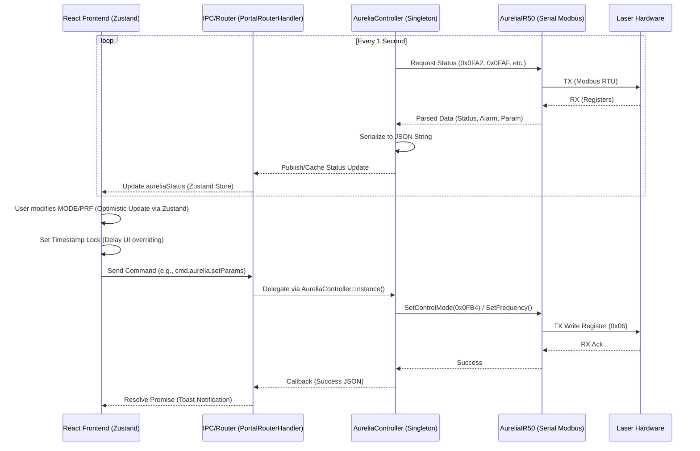

# Aurelia Laser Communication Architecture

## 1. Data Flow Diagram (C++ Backend ↔ React Frontend)
본 시스템은 React 기반의 프론트엔드와 C++ 기반의 하드웨어 제어 백엔드 간 비동기 IPC(Inter-Process Communication) 및 백그라운드 폴링(Background Polling) 메커니즘을 통해 상태 동기화를 수행합니다.

## 2. 설계 원칙 (Design Principles & Scalability)

### 2.1. Clean Architecture 및 SOLID 원칙 적용
*   **단일 책임 원칙 (SRP) 및 파사드 패턴 (Facade Pattern)**: `PortalRouterHandler`는 프론트엔드 IPC 요청의 라우팅만 담당하며, 실제 제어 로직은 `AureliaController`로 위임합니다.
*   **의존성 역전 원칙 (DIP)**: `AureliaController`는 구체적인 하드웨어 통신 클래스에 직접 의존하지 않고, `IAureliaController` 인터페이스를 통해 확장 가능하도록 설계되어 추후 다른 레이저 모듈로 교체하더라도 IPC 계층에 영향을 주지 않습니다.

### 2.2. 낙관적 업데이트 (Optimistic State Synchronization)
*   하드웨어 응답 및 폴링 딜레이(약 1~2초)로 인한 UI의 롤백/플리커링(Flickering) 현상을 방지하기 위해 프론트엔드 상태 저장소(Zustand)를 사용한 낙관적 업데이트(Optimistic Update) 전략이 도입되었습니다.
*   사용자 입력 시 상태를 선반영하고, `lastUpdatedRef` 타임스탬프 락 메커니즘을 통해 3초간 백엔드의 폴링 데이터 오버라이드를 차단하여 유저 경험(UX)의 연속성을 보장합니다.

## 3. 통신 프로토콜 (Communication Protocols)

### 3.1. IPC Layer (Application Layer)
*   명령 전송은 JSON 스키마를 따르는 비동기 메시지 패싱(CEF `window.cefQuery` 또는 REST-like 구조) 방식을 채택했습니다.
*   **Command ID 예시**: 
    *   `cmd.aurelia.setParams`: `{ "prf": 1000, "amp": 6, "mode": 2 }` (0=TRIG, 1=ADJ, 2=GATE)
    *   `cmd.aurelia.power`: `{ "on": true }`
    *   `cmd.aurelia.shutter`: `{ "open": true }`

### 3.2. Hardware Layer (Modbus RTU)
*   **Payload Construction**: `AureliaIR50` 클래스 내에서 CRC16 썸네일 검증 및 Read(0x03)/Write(0x06) 기능 코드를 조합한 시리얼 바이트 배열 송수신 로직을 관장합니다.
*   **Register Map**: `0x0FB4` (Operating Mode), `0x0FA9` (Shutter), `0x0FAF` (Alarm Information) 등 제조사 명세 기반의 레지스터를 직접 매핑하여 읽고 씁니다.

## 4. 에러 핸들링 (Error Handling Process)

1.  **Hardware Layer (RS-232 / Modbus)**: 
    *   통신 시간 초과(Timeout) 또는 CRC 불일치 시 패킷을 폐기하고 `false`를 리턴하여 잘못된 값이 전파되는 것을 차단합니다.
2.  **Controller Layer (C++)**: 
    *   시리얼 통신 실패 횟수를 누적하거나, 하드웨어에서 전달받은 Alarm 정보(`0x0FAF` 등)를 파싱합니다.
    *   특수 하드웨어 특성(IL 접점 상태 1=정상 등)을 고려한 비트 마스킹(Bit Masking) 처리를 거쳐 정형화된 JSON 에러 상태 필드(`t_alarm`, `il`, `ol` 등)로 규격화합니다.
3.  **Frontend Layer (React)**: 
    *   IPC 요청 실패 시 `Promise.reject`를 Catch하여 Toast 알람으로 시각화합니다.
    *   장비의 `power_status`가 Turn On 시퀀스 진행 중이거나, 에러 상태일 경우 입력 폼과 버튼들을 `disabled` 처리하여 사용자 오조작(Deadlock)을 방지합니다.

## 5. 향후 확장 계획 (Future Scalability Roadmap)

*   **다중 장비 통합 프로토콜 도입**: 현재 하드코딩된 RS-232 통신 프로토콜을 추상 레이어로 분리하여, 향후 TCP/IP 혹은 UDP 기반의 레이저 장비가 도입되더라도 `IProtocol` 계층만 교체하여 재사용할 수 있는 플러그인 아키텍처로 고도화할 예정입니다.
*   **상태 폴링 옵티마이저 (Adaptive Polling)**: 고정된 1초 주기의 폴링 방식을, 장비가 Idle 상태일 때는 주기를 늘리고 Processing 중일 때는 주기를 단축시키는 반응형(Adaptive) 스케줄러로 개선하여 시리얼 대역폭과 CPU 점유율을 최적화할 계획입니다.
*   **로깅 파이프라인 (Audit Trail)**: `AureliaController` 내 파라미터 변경 이력을 백엔드 파일 시스템 로거나 SQLite DB로 영속화(Persistence)하여, 장비 트러블슈팅 및 공정 히스토리 추적을 위한 데이터 레이크 기반을 마련합니다.
