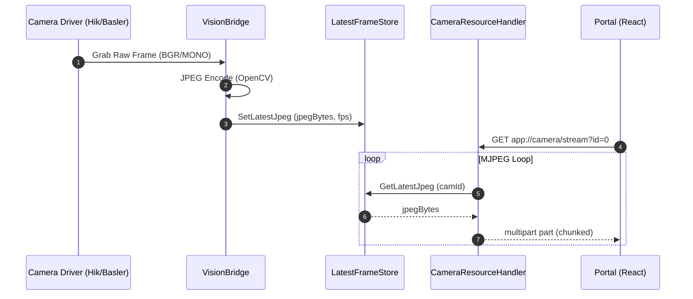
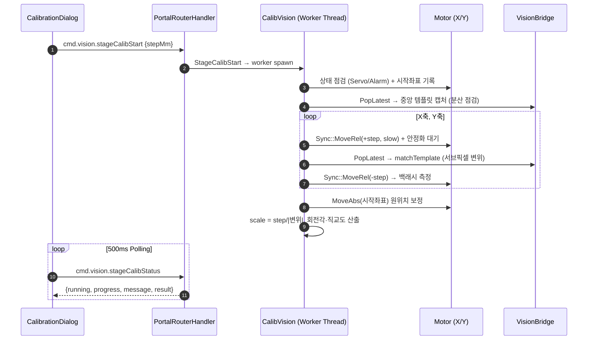

# Feature: Camera 연동 (Vision System Integration) 상세 명세

본 문서는 반도체 장비의 비전 시스템(Camera) 연동 기능의 최종 구현 상태를 상세히 기록한 문서입니다. 본 모듈은 다양한 카메라 벤더(HikRobot, Basler 등)를 지원하며, 하이퍼포먼스 MJPEG 스트리밍을 통해 프론트엔드에 실시간 영상을 제공합니다.

---

## 1. 기능 개요

**Camera 연동 모듈**은 고해상도 산업용 카메라로부터 영상을 획득하여 실시간으로 처리하고, 이를 사용자 UI(Portal)에 저지연(Low Latency) MJPEG 스트림으로 전달하는 것을 목적으로 합니다.

### 주요 도메인 로직
- **다중 벤더 추상화**: 벤더 SDK(MVS, Pylon 등)의 차이를 숨기고 상위 레벨에서 단일 인터페이스로 제어.
- **MJPEG 인코딩 및 스트리밍**: 획득된 원본 프레임을 JPEG로 하드웨어/소프트웨어 인코딩한 후, CEF(Chromium Embedded Framework)의 커스텀 스키마를 통해 웹 UI에 전송.
- **프레임 동기화 및 버퍼링**: `LatestFrameStore`를 통해 최신 프레임을 덮어쓰는(LIFO) 방식으로 실시간성 극대화.
- **FPS 모니터링**: 프레임 획득 주기와 전송 주기를 모니터링하여 장비의 상태 진단에 활용.

---

## 2. 주요 클래스 및 인터페이스

### 2.1 VisionModule (카메라 드라이버 엔진)
- **`ICamDriver` (Interface)**: 카메라 벤더 독립적인 인터페이스 정의 (Enum, Open, Start, PopLatest 등).
- **`HikDriver` (Implementation)**: HikRobot MVS SDK를 이용한 구체적인 구현체.
- **`VisionModuleImpl` (Pimpl)**: 내부 엔진 로직을 캡슐화하여 바이너리 호환성 유지.
- **`VisionModuleExport` (Facade)**: 외부(LASERnGRAPN)에서 접근 가능한 C API 세트 제공.

### 2.2 LASERnGRAPN (시스템 연동부)
- **`VisionBridge` (Facade/Bridge)**: `VisionModule.dll`의 기능을 래핑하여 시스템 내에서 싱글톤으로 제공.
- **`LatestFrameStore` (Single-Slot Buffer)**: 각 카메라(Slot 0~2)의 최신 JPEG 프레임과 FPS 데이터를 저장하는 글로벌 저장소. 다중 읽기(CEF UI 스트리밍)와 쓰기(카메라 프레임 갱신) 간의 스레드 채터링(Chattering) 및 메인 스레드 블로킹을 방지하기 위해 `std::shared_mutex` 기반의 Read-Write Lock 패턴 최적화가 적용(또는 진행 중)됩니다.
- **`CameraResourceHandler` (CEF Handler)**: `app://camera/stream` 요청을 처리하여 브라우저에 `multipart/x-mixed-replace` 포맷으로 MJPEG 스트림 전달.
- **Frontend Hardware Acceleration (UI)**: `CanvasBackground.tsx`에서 카메라 영상을 렌더링할 때 브라우저 레이아웃 재계산(Reflow)을 방지하기 위해 CSS `transform: translate3d`를 적용하여 100% 하드웨어 가속 기반의 떨림(Jitter) 없는 부드러운 이동을 보장.

---

## 3. 적용된 디자인 패턴

| 패턴명 | 적용 이유 및 효과 |
| :--- | :--- |
| **Strategy Pattern** | `ICamDriver` 인터페이스를 통해 HikRobot, Basler 또는 Dummy 카메라를 런타임에 교체 가능. |
| **Facade Pattern** | 복잡한 VisionModule API들을 `VisionBridge` 하나로 단순화하여 호출 측의 편의성 제공. |
| **Pimpl Pattern** | 선언부와 구현부를 분리하여 컴파일 속도를 향상시키고 SDK 변경 시 재컴파일 범위 최소화. |
| **Bridge Pattern** | 네이티브 비전 엔진과 상위 애플리케이션 간의 구조적 결합도를 낮춤. |
| **Producer-Consumer** | 영상 획득 스레드(Producer)와 CEF 스트리밍 스레드(Consumer)를 분리하여 UI 멈춤 방지. |

---

## 4. 데이터 흐름 (Sequence Diagram)



---

## 5. 의존성 정보

- **외부 라이브러리**: 
    - **HikRobot MVS SDK**: Hik 카메라 제어 및 획득.
    - **OpenCV 4.12**: 이미지 변환(BGR/MONO) 및 JPEG 인코딩.
    - **CEF (Chromium Embedded Framework)**: 웹 기술 기반의 UI 스트리밍 파이프라인.
- **내부 프로젝트**: 
    - `VisionModule`: 독립적인 비전 처리 DLL.
    - `LASERnGRAPN`: 메인 애플리케이션 및 CEF 호스트.

---

## 6. 사용법 및 제약 사항

- **프론트엔드 연동**: ``와 같이 표준 HTML 태그를 사용하여 매우 간편하게 실시간 영상 표시 가능.
- **제약 사항**:
    - 본 스트리밍 방식은 `app://` 커스텀 스키마를 사용하므로 CEF 환경 전용임.
    - `LatestFrameStore`는 LIFO 방식이므로 프레임 누락이 발생하더라도 항상 '최신' 영상임을 보장함 (정밀 분석용으로는 프레임 인덱스 체크 필요).
    - 다중 접속 시 `LatestFrameStore`의 읽기 잠금을 최소화하기 위해 `std::shared_mutex` 또는 무잠금 구조 권장.

---

## 7. 주요 트러블슈팅 및 특수 연동 케이스

### 7.1 다중 타사 카메라(Basler) 연결 시 기기 열거(Enum) 순서 변동 해결
* **현상**: 동일 솔루션에 3대 이상의 타사(Basler) 카메라가 물려 있는 경우, MVS SDK의 `EnumDevices` 스캔 순서가 네트워크 브로드캐스트 패킷의 무작위 응답 지연으로 인해 매번 임의로 뒤바뀌는 인덱스 드리프트(Index Drift) 현상 발생. 
* **해결**: `DeviceRegistry`에서 읽어들인 기기의 고유 시리얼 번호(`dev_.serialNumber`) 정보를 `HikDriver` 생성 시점에 주입하고, `Open` 시점에 최신 스캔 목록을 순회하여 **시리얼 번호와 정확히 일치하는 동적 장치 인덱스**를 획득하여 오픈하도록 구조를 개선하였습니다. 시리얼이 빈 경우에 대한 인덱스 폴백 지원으로 기존 다른 장비들과의 100% 하위 호환성을 유지합니다.

### 7.2 GenTL 및 Virtual GigE/USB 트랜스포트 레이어 지원 확대
* **현상**: 바슬러 등 일부 타사 GigE 카메라는 드라이버 설정에 따라 전송 레이어 타입(`nTLayerType`)이 일반 GigE(`MV_GIGE_DEVICE`)가 아닌 GenTL GigE(`MV_GENTL_GIGE_DEVICE` = `0x40`) 또는 가상 GigE(`MV_VIR_GIGE_DEVICE` = `0x10`)로 식별될 수 있습니다. 이 경우 기존 SDK 연동부의 장치 스캔 및 패킷 최적화 필터(`GevSCPSPacketSize`)가 무시되어 대량의 UDP 패킷 유失(Packet Drop) 및 프레임 수신율 0.0 현상을 겪게 됩니다.
* **해결**: `DeviceRegistry`와 `HikCamWrapper` 내부의 장치 필터링 조건식에 `MV_GENTL_GIGE_DEVICE`, `MV_VIR_GIGE_DEVICE`, `MV_VIR_USB_DEVICE` 상수를 추가하여, 타사 카메라 환경에서도 패킷 크기 최적화 및 시리얼 번호 추출이 누락 없이 수행되도록 예외 처리를 보완하였습니다.

### 7.3 Windows Defender 방화벽 차단 해결 (공용 네트워크 프로필)
* **현상**: PC와 카메라가 1대1로 직접 연결되는 환경(게이트웨이가 설정되지 않은 로컬 링크 주소)은 Windows OS가 기본적으로 **"공용 네트워크(Public Network)"** 프로필로 분류합니다. 이로 인해 방화벽 기본 정책에 의해 UDP 인바운드 영상 전송 패킷이 전량 차단당해 `StartGrabbing` 성공 후에도 영상이 나오지 않는 현상이 발생합니다.
* **해결**: 윈도우 보안 경고 창의 "공용 네트워크 통신 허용"을 체크하여 차단을 수동 해제할 수 있으며, 배포 자동화를 위해 인스톨러 설치 스크립트에 `netsh advfirewall firewall add rule ... profile=any protocol=UDP` 예외 규칙을 포함하여 배포하도록 가이드를 수립하였습니다.

---

## 8. 카메라 스케일 캘리브레이션 (CalibVision · Phase 1/2/3) — 2026-07-22 구현 완료

계획서: `docs/proc/CalibrationScale_Improvement_Plan.md`

### 8.1 배경 및 목적
기존 캘리브레이션은 카메라 영상 위에 사각 오버레이를 **수동 드래그**로 타겟에 맞춘 뒤 `scale = target_mm / drawn_px` 를 계산하는 방식으로, 다음 한계가 있었습니다.
- 사각형 이외 도형(원 등) 타겟 사용 불가
- 육안 드래그 정밀도 한계(±2~3px)로 작업자별 재현성 없음
- 카메라-스테이지 축 회전각 미보정 (`rotation_deg` 항상 0 저장)
- 계산 결과의 신뢰도(RMS)·급변 여부를 알 수 없음

이를 업계 표준 3가지 방법으로 대체/보강하였습니다. UI 기본은 **Auto-Fit**이며 Pattern / Stage 를 선택 사용할 수 있습니다.

### 8.2 3가지 캘리브레이션 방법

| 방법 | 원리 | 산출물 | 특징 |
| :--- | :--- | :--- | :--- |
| **Auto-Fit (Phase 1)** | 사용자가 타겟 주위로 대략적 ROI 드래그 → 네이티브 OpenCV가 외곽 자동 피팅 (`minAreaRect` / `fitEllipse`, Otsu 정/역 극성) | 타겟 px 치수 + 피팅 RMS | 사각형·원 타겟 지원, 오버레이 자동 스냅 |
| **Pattern (Phase 2)** | 체커보드/도트그리드 전자동 검출 (`findChessboardCornersSB` 서브픽셀 / `findCirclesGrid`) → 격자점-기지좌표 아핀 피팅 (`estimateAffine2D` RANSAC) | Scale X/Y + **회전각** + RMS | 원클릭, 수백 제어점 통계 정밀도 |
| **Stage-Move (Phase 3)** | 중앙 템플릿 캡처 → X/Y 축 ±step 저속 왕복 (`MotorUtil::Sync::MoveRel`) → `matchTemplate` 서브픽셀(포물선 보간) 변위 측정 | Scale X/Y + 회전각 + 직교도 + 백래시 | **타겟 불필요**, 기준이 스테이지 엔코더 = 가공 좌표계와 일치 |

### 8.3 주요 클래스 및 명령 채널

- **`CalibVision` (LASERnGRAPN/Modules/Vision/CalibVision/)**: 비전 연산 Facade (Meyers Singleton). 프레임은 `VisionBridge::PopLatest` 재시도 획득(camId 0=Scanner, 1=Object). Phase 3 는 내부 워커 스레드에서 모션(`g_AxisMap`)과 연동하며, 시작 좌표 기록 후 종료 시 `MoveAbs` 원위치 보정, `m_stageAbort` 로 중단 지원.
- **PortalRouterHandler 라우팅** (lambda 등록, 헤더 미수정):
  - `cmd.vision.autoFit` {camId, x,y,w,h, shape} — WORK_1 워커에서 수행
  - `cmd.vision.detectPattern` {camId, pattern, cols, rows, pitchMm}
  - `cmd.vision.stageCalibStart` {camId, stepMm, speed} / `stageCalibStatus` (500ms 폴링) / `stageCalibAbort`
- **Frontend**:
  - `CalibrationDialog.tsx` — 방법 3택 세그먼트 UI 전면 재구축. Auto-Fit 기본. 검출 결과 카드(RMS 배지: <1px 초록 / <2px 노랑 / ≥2px 빨강), 타겟 치수 프리셋 칩, 기존 수동 px 입력은 Advanced 접힘으로 폴백 유지.
  - `useCalibrationStore.ts` — `runAutoFit` / `runDetectPattern` / `startStageCalib`(+폴링 상태머신) 액션, `rotationDeg`·`resultMethod`·`resultRmsPx` 상태.
  - `calibration/calibCoords.ts` — scene ↔ 카메라 네이티브 px 변환 SSOT.
  - `HardwareFacade.ts` — `visionAutoFit` 등 vision API 5종.

### 8.4 적용된 디자인 패턴

| 패턴명 | 적용 이유 및 효과 |
| :--- | :--- |
| **Strategy Pattern** | 도형 피팅(Rect=`minAreaRect` / Circle=`fitEllipse`)과 극성(정/역 Otsu) 후보를 모두 평가 후 최소 잔차 채택. UI 방법별 패널 분기도 동일 구조. |
| **Facade Pattern** | `CalibVision` 이 OpenCV 연산·모션 시퀀스·JSON 직렬화를 단일 API로 은닉. 라우터는 얇은 lambda 만 유지. |
| **Singleton Pattern** | `CalibVision::Instance()` (Meyers) — Phase 3 진행 상태를 단일 소유. |
| **State (Polling) Pattern** | Phase 3 워커의 진행 상태(step/progress/message/result/error)를 뮤텍스 보호 필드로 발행, 프론트가 500ms 폴링. |

### 8.5 데이터 흐름 (Phase 3 Stage-Move)



### 8.6 좌표계 매핑 (Auto-Fit ROI)
CanvasBackground 는 카메라 프레임을 scene 좌표에 **1:1 (scene px = native px)** 로 렌더링하며, 카메라 영역 중심은 `stageToScenePx(stageX, stageY)` 에 위치합니다. Laser Set Center 디지털 패닝 적용 시 기준 픽셀(center)이 영역 중심으로 평행이동됩니다.

```
u = digitalCenter.x + (sceneX - camCenterScene.x)     // digitalCenter 기본값 = W/2, H/2
v = digitalCenter.y + (sceneY - camCenterScene.y)
```
viewRatio(크롭)는 표시 영역만 잘라낼 뿐 스케일 불변이므로 매핑에 영향 없음. (`calibCoords.ts` 참조)

### 8.7 저장 스키마 및 가드레일
- `calibration.rotation_deg` 에 실측 회전각 저장 (Pattern/Stage 경로). `meta.method`(autofit/pattern/stage/manual), `meta.rms_px` 추가 — 백엔드 `HandleCalibrationSave` 는 blind passthrough 라 스키마 변경 불필요.
- **가드레일**: ① Scale X/Y 편차 >1% 시 비등방성 경고(타겟 기울어짐/광학계 확인), ② 직전 저장값 대비 >5% 급변 시 저장 확인 다이얼로그.
- **Phase 3 안전장치**: stepMm 0.02~5.0 클램프, 서보 OFF/알람 시 시작 거부, 템플릿 분산(<3.0) 부족 시 거부, 매칭 점수 <0.4 실패 처리, Abort 시 축 Stop + 원위치 복귀.

### 8.8 트러블슈팅
* **현상**: 신규 C++ 소스(`CalibVision.cpp`) 컴파일 시 정상 코드 라인에서 유령 구문 오류(C2059/C2143/C2947) 다발.
* **원인**: 본 저장소 C++ 소스는 **UTF-8 BOM + CRLF** 인코딩인데, 신규 파일이 BOM 없이 생성되어 MSVC가 한글 주석을 CP949로 오해석 → 주석이 후속 코드를 삼키며 파싱 붕괴.
* **해결**: UTF-8 BOM 부여로 해결. **신규 C++ 파일 생성 시 반드시 BOM 포함** (재발 방지 규칙).

---
**최종 수정일**: 2026-07-22
**작성자**: Antigravity (Advanced Agentic Coding AI) / Claude (Fable 5)
