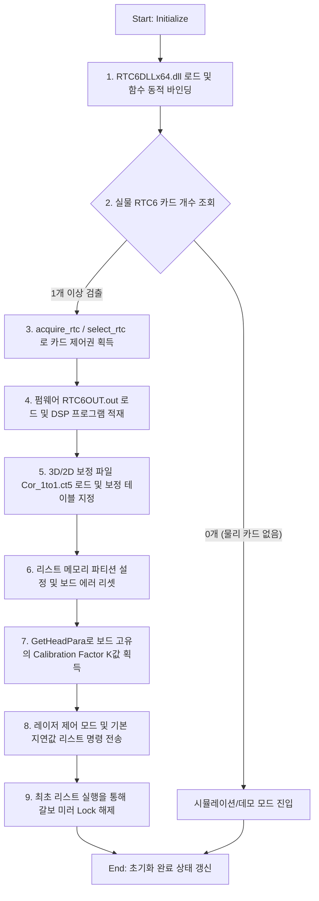

# Feature Checklist: Scanlab Scanner 연동 및 가공 프로세스

본 문서는 SinoGalvo 및 Scanlab (RTC 4/5/6) 멀티 스캐너 아키텍처 연동 및 제어 시퀀스를 기록합니다. 특히, 주니어 개발자들도 쉽게 이해할 수 있도록 **RTC6 보드의 초기화 시퀀스, SCANcube III 10 스캐너 초기화 연결, 가공 변환 프로세스, 그리고 최근 수행된 UI 연결 배지 오진 개선 내역**을 상세히 다룹니다.

---

## 1. 최근 수정 내역

### ① UI 연결 배지 오진 및 DISCONNECTED 고정 버그 해결
* **문제 현상**: 실물 마킹 가공 및 미러 원점 복귀(`0, 0` 이동)는 정상 동작하였으나, UI 화면의 `SCANLAB RTC6` 표시 배지는 계속 빨간색 `DISCONNECTED` 상태로 머물러 있었습니다. 또한 로그 파일 상에 `StatusPolling_M12` 로그가 누락되어 있었습니다.
* **원인 분석**:
  1. **로그 분기**: 해당 장비는 **Fastech 모터(Machine Type 3)** 설정을 사용하고 있어 `PollingLoopMachineType3()` 스레드가 작동합니다. 따라서 `StatusPolling_M12` 대신 `StatusPolling_M3` 로그가 출력되는 것이 맞습니다.
  2. **헤드 상태 비트 판정 오류**: 실측 로그 분석 결과, 기동 성공 시 하드웨어 상태 값은 `initStatus = 2147483648` (`0x80000000`), `headStatus = 63993` (`0xF9F9` = `0b1111100111111001`)로 정상 수집되었습니다. 하지만 기존 C++ 판정식은 헤드 상태의 비트 11, 12, 13이 `0`이어야 정상으로 진단하도록 부호 논리가 반대로 되어 있어 정상 장비를 `DISCONNECTED`로 오진하고 있었습니다.
* **조치 내용**:
  * [PortalRouterHandler.cpp](file:///c:/LNG/Source/LW2-3/LASERnGRAPN/Core/Communication/PortalRouterHandler.cpp)의 `PollingLoopMachineType1or2()` 및 `PollingLoopMachineType3()` 내부의 판정식을 수정했습니다.
  * 최상위 비트(Bit 31) 검출(`initStatus & 0x80000000`) 및 비제로 헤드 상태 검사(`hs != 0`)를 적용하고, 가공 카드 비탑재 시 실행되는 시뮬레이션(데모) 모드 상태(`initStatus == 0 && hs == 0 && IsOpen() == true`)까지 통합 커버하도록 예외 조건식을 보완하여 연결 표시등을 초록색 **`CONNECTED`** 상태로 복구 완료했습니다.

### ② ScanlabConfig.json 경로 참조 오류 수정
* **문제 현상**: 빌드 후 이벤트로 `ScanlabConfig.json` 파일이 `Bin` 루트 폴더에 복사되나, `ScanlabController.cpp` 내의 `LoadConfig`/`SaveConfig` 에서는 하위 폴더인 `Config\ScanlabConfig.json`을 참조하여 설정 파일 입출력이 정상적으로 이뤄지지 않는 문제가 있었습니다.
* **조치 내용**: 하드코딩된 참조 경로 문자열을 제거하고 DLL 구동 폴더 기준 `Bin\ScanlabConfig.json`을 직접 참조하도록 C++ 코드를 교정하여 영속성을 확보했습니다.

### ③ `goto_xy` 등각/즉각 점프 기능 드라이버 이식
* **문제 현상**: 장비 임의 위치 이동 등에서 실시간으로 스캐너 미러를 센터나 특정 타겟으로 점프시켜야 할 때 `JumpAbs` 등은 List 버퍼를 거쳐야 하므로 즉각 반응이 어려울 수 있었습니다.
* **조치 내용**:
  * RTC6 라이브러리의 `goto_xy` API를 사용할 수 있도록 `IRtcDriver.h`와 `Rtc6Driver.h/cpp`에 함수 포인터 바인딩 로직을 추가했습니다.
  * 이를 통해 가공 중지(Stop) 시 딜레이 없이 즉각 미러를 `(0, 0)` 센터 포지션으로 복귀시킬 수 있는 기반을 마련했습니다.

### ④ RTC 버퍼 전송률과 가공 진행률(Processing Rate) 분리
* **문제 현상**: 스캐너 렌더링 시 대용량 명령어가 하드웨어 버퍼로 고속 적재(Compile)되는 과정을 `__onScannerProgress` 이벤트를 통해 브로드캐스트하였습니다. UI 측에서는 이 이벤트를 통해 "RTC Buffer Status"뿐만 아니라 "전역 가공 진행률(Processing Rate)"까지 100%로 덮어씌워버려, 버퍼 전송 완료 직후 실제 가공이 진행 중임에도 Processing Rate가 변동 없이 100%에 고정되는 문제가 있었습니다.
* **조치 내용**:
  1. `ScanlabProcessPanel.tsx` 및 `SinoGalvoProcessPanel.tsx` 내에서 전역 Processing Rate 업데이트 로직을 제거하여 로컬 버퍼 프로그레스 용도로만 격리.
  2. C++ 드라이버에서 스캐너(Scanlab, SinoGalvo)의 실시간 마킹 퍼센티지를 하드웨어 레벨에서 연속 폴링하기 어려운 한계를 보완하기 위해, `useProcessMonitor.ts`에 기존 주석 처리되어 있던 **시간 기반 가공 진행률 추정 로직(Time-based Progress Estimation)**을 복원했습니다.
  3. 이로 인해 가공 명령 전송(Buffer Status)은 시작 직후 100%를 달성하고, 실제 **Processing Rate**는 예상 가공 시간(`estimatedTotalSeconds`)에 비례해 부드럽게 증가하게 됩니다. (오브젝트 G-Code 모드는 기존대로 PMAC 현재 라인 질의 방식으로 정확히 구동됨을 재확인)

### ⑤ ScanlabConfig.json 세부 파라미터 UI 연동 및 읽기 전용 보호
* **문제 현상**: 스캔랩 설정 파일(`ScanlabConfig.json`)의 `cardNo`, `kFactor`, `laserMode`, `laserControl` 등 핵심 구동/캘리브레이션 옵션이 UI에 연동되지 않아 캘리브레이션 및 Reload/Save가 불가능했습니다. 또한 공장 셋업 관련 필수 정보(`programFile`, `correctionFile`)에 대한 임의 조작 방지 조치가 없었습니다.
* **조치 내용**:
  * C++ 컨트롤러 및 IPC 핸들러(`HandleConfigGetScanner/SetScanner`)를 확장하여 10개 파라미터 항목의 양방향 바인딩을 구현했습니다.
  * UI 상에서 `programFile`, `correctionFile`은 비활성화(`disabled={true}`) 텍스트박스로 제공하여 읽기 전용으로 보호했습니다.

### ⑥ System Settings 입력창 제거 및 Hardware Diagnostics 실시간 연동 (핫픽스 포함)
* **문제 현상**:
  1. 기존 UI의 `System Settings` 카드에 노출되었던 `RTC Version`, `Card Number`, `Laser Mode`, `Laser Control` 입력창은 사용자가 임의로 조작 시 안전사고나 장비 오작동을 유발할 위험이 있어 입력창을 제거해야 했습니다.
  2. 스캐너 보드 내부 칩셋으로부터 실시간 장비 정보(DLL 버전, 펌웨어 버전, 보드 버전, 일련번호)를 읽어와 화면에 모니터링해야 했습니다.
  3. 최초 연동 시 싱글톤 `ScanlabController::Instance()`의 상태를 조회하여 모든 실시간 하드웨어 버전 및 시리얼 번호가 `-`로 표출되던 버그가 발생했습니다.
* **조치 내용**:
  * UI에서 `System Settings` 입력 카드를 완전히 제거했습니다. (기존 장비 구동 설정은 UI State 단에서 보존하여 `Save Changes` 시 기존 json 내용이 유지되게 하였습니다.)
  * 대신 **[Hardware Diagnostics]** 카드를 신설하고 `Device (SCANLAB-RTC)`, `DLL Ver.`, `Hex Ver.`, `RTC Ver.`, `Serial Number` 항목을 비활성화된 읽기 전용 필드로 추가 배치했습니다.
  * 백엔드에서 실시간 정보를 조회할 때 드라이버가 초기화되지 않은 싱글톤 객체 대신, 실제 하드웨어 통신을 처리하는 전역 활성 인스턴스인 **`g_Scanner`**를 `ScanlabController`로 동적 캐스팅(`dynamic_cast`)하여 로드된 드라이버로부터 직접 상태 값을 읽어오도록 핫픽스 코드를 보정하고 빌드 검증을 마쳤습니다.

### ⑦ K-Factor 파라미터 실시간 적용 버그 해결 및 실시간 하드웨어 값 모니터링/툴팁 가이드 추가
* **문제 현상**: 
  1. K-Factor, 가공 속도 등을 UI에서 수정 후 저장하더라도 장비 재시작 전까지는 실시간으로 적용되지 않았습니다. (원인: `g_Scanner` 인스턴스가 런타임에 이미 초기화되어 활성화된 상태에서, 저장 시 싱글톤 `ScanlabController::Instance()`의 상태 및 JSON 파일만 업데이트될 뿐 활성 인스턴스에는 적용되지 않음)
  2. 사용자가 K-Factor의 단위를 배율(Ratio, 예: `0.9` 또는 `1.1`)로 오해하고 0.9 등의 값을 입력하면, C++ 드라이버는 이를 bits/mm 단위의 물리 해상도로 인식하여 좌표계가 심하게 축소되고, 속도 환산 결과(`0.9 bits/ms`)가 RTC6 보드 하한 규격 제한을 벗어나 에러를 유발하며 가공 시퀀스가 가공 없이 실행 즉시 100% 완료로 조기 종료되었습니다.
* **조치 내용**:
  * **C++ 백엔드**: 파라미터 저장(`SaveConfig()`) 완료 성공 시, 현재 가동 중인 `g_Scanner` 인스턴스를 확보하여 설정을 디스크에서 다시 로드(`LoadConfig()`)하고 K-Factor 재계산, 속도(Speed) 및 레이저 파라미터를 하드웨어 카드에 즉시 주입하는 `ApplyActiveParameters()` 메소드를 구현하여 재시작 없이 파라미터를 즉시 실시간 적용 완료했습니다.
  * **K-Factor 실측값 연동**: `PortalRouterHandler`를 확장하여 현재 활성 보드(`g_Scanner`)로부터 캘리브레이션 팩터 실측값(`GetActiveKFactor()`)을 조회하여 프론트엔드로 `activeKFactor` 필드로 송신하도록 연동했습니다.
  * **프론트엔드 UI/UX**: `ScanlabParameterForm.tsx` 내 K-Factor Override 입력 필드에 마우스 호버 시 실시간 적용 중인 하드웨어 값 및 계산 공식 예시(`2^20 / 가공 영역 크기 -> 1048576 / 110 = 9532.5`)를 동적으로 보여주는 상세 가이드 툴팁을 추가했습니다.
  * **오입력 사전 검증(Validation)**: 프론트엔드 및 백엔드에 K-Factor를 배율(0~100)로 오기입 시 에러 토스트(Toast) 메시지와 로그를 띄우고 저장을 강제 제한하도록 유효성 검증을 삽입하여 하드웨어 오동작 위험을 사전에 차단했습니다.
### ⑧ 구형 머신 타입(MC1~MC4) 하위 호환성 잔재 완벽 제거
* **문제 현상**: 이전 버전에서 사용되던 구형 하드웨어 호환성 분기 로직(`MC1`, `MC2`, `MC3`, `MC4`)이 `PortalRouterHandler.cpp` 내의 일부 IPC 응답 코드에 잔존해 있었습니다.
* **조치 내용**: 하위 호환성 문자열 응답 블록을 백엔드에서 완전히 삭제하여 코드베이스를 정리했습니다.

### ⑨ 하드웨어 오프라인 상태 시 Process Start 무한 대기(Freeze) 오류 해결
* **문제 현상**: 장비가 오프라인(미연결)된 상태에서 Process Start 버튼을 누를 경우, 백엔드의 C++ `ScanlabController::Run()`에서는 `Initialize()` 실패로 조기 종료되나 상태 초기화 신호(`idle`)를 반환하지 않아 프론트엔드 UI가 무한 대기(Freeze)에 빠지는 현상이 있었습니다. 또한 프론트엔드 내 `setScannerGenStatus` 변수 매핑 오류(ReferenceError)로 인해 프로세스가 도중에 뻗는 현상도 존재했습니다.
* **조치 내용**:
  1. 백엔드 조기 종료 시 명시적으로 `idle` 상태 이벤트와 함께 `window.__showToast` 에러 메시지를 브로드캐스트 하도록 예외 처리 코드를 보강했습니다.
  2. 프론트엔드의 `HardwareFacade.ts`에 전역 `window.__showToast` 핸들러를 등록해 백엔드의 알림을 즉각 UI Toast 알림으로 띄우도록 브릿지를 연동했습니다.
  3. `ScanlabProcessPanel.tsx`에서 오기입된 `setScannerGenStatus` Zustand 상태 매핑 오류를 올바르게 수정하여 프로세스 시작 시점의 UI 크래시를 방지했습니다.

### ⑩ Wavelength (Laser Type) 파라미터 파일 영구 저장 및 자동 로드 적용
* **문제 현상**: 파라미터 탭에서 Wavelength 옵션(UV / IR)을 변경하고 Save Changes를 눌러도 설정이 파일(`ScanlabConfig.json`)에 저장되지 않고, 재시작 시 늘 기본값으로 초기화되었습니다. 백엔드 코어에는 로직이 있었으나 프론트엔드 통신 IPC 및 상태 관리에서 필드 매핑이 누락되어 있었습니다.
* **조치 내용**:
  * C++ IPC 핸들러(`PortalRouterHandler.cpp`)의 Get/Set 응답 데이터에 `wavelength` 항목을 추출 및 전송하도록 매핑을 추가했습니다.
  * React 컴포넌트(`ScannerParameterForm.tsx`) 상태 초기값 및 `loadConfig` 시 `wavelength` 항목을 포함하도록 업데이트하여 영구 저장 기능을 복원했습니다.
### ⑪ 단일 프로그램 내 UV/IR 스캐너 정밀 제어 통합 및 UI/UX 전면 개편
* **개선 목적**: 사용자 편의성 극대화 및 하드웨어 매뉴얼(Scanlab 2D Correction File) 원리에 기반한 파라미터 직관화.
* **조치 내용**:
  1. **K-Factor 수동 오버라이드 및 Correct Size 폐기**:
     - 기존 사용자가 임의 배율을 짐작하여 넣던 K-Factor 오버라이드 입력란과, 과거의 역산용 크기 입력란(`Correct Size`)을 과감히 삭제했습니다.
     - 대신, Wavelength 선택 시 매핑되는 정품 `.ct5` 파일에서 **하드웨어 칩셋 고유의 1mm당 bit 해상도 값(K-Factor)**을 `get_head_para(1, 1)` 로 자동 추출하여 활용하도록 근본 원리를 바로잡았습니다.
  2. **가공 속도 우선순위 명확화**:
     - `Mark Speed`는 레시피가 없을 때의 기본값으로, `Jump Speed`는 레이저 오프 시 이동 속도 제어용 필수 값으로 유지했습니다.
  3. **그리드 레이아웃(Grid Layout) 최적화**:
     - 시선이 가장 먼저 닿는 **좌측 상단**에 [Hardware Diagnostics]를 배치하여 통신 및 칩셋 버전을 즉시 모니터링하게 했습니다.
     - **우측 상단**에는 [Firmware & Correction] 카드를 배치해 UV/IR 변경(Wavelength)에 따른 보정 파일 연동 내역과 자동 추출된 `Active K-Factor` 수치를 읽기 전용으로 투명하게 공개했습니다.
     - 툴팁을 통해 내부 속도(`Target × K-Factor ÷ 1000`) 및 좌표 연산 공식의 이해를 도왔습니다.

---

## 2. RTC6 보드 초기화 시퀀스 (Initialization Sequence)

RTC6 컨트롤 카드를 소프트웨어로 제어하기 위해서는 DLL 바인딩부터 펌웨어(DSP) 로드, 보정 파일 매핑, 갈보 락 해제까지의 일련의 단계를 정확히 거쳐야 합니다. [ScanlabController.cpp](file:///c:/LNG/Source/LW2-3/LASERnGRAPN/Modules/Scanner/ScanLab/Base/ScanlabController.cpp)에 구현된 실제 코드는 다음과 같은 흐름으로 보드를 초기화합니다.



### 상세 단계 설명 (주니어 가이드)
1. **DLL 로드 및 API 바인딩 (`InitDll`)**:
   * 실행 경로 내의 `RTC6DLLx64.dll`을 `LoadLibrary`로 메모리에 올린 후, C++ 코드 내부 포인터에 `GetProcAddress`를 통해 보드 제어 함수 주소를 일대일로 대입합니다.
2. **제어권 획득 및 카드 오픈 (`OpenCard`)**:
   * `rtc6_count_cards()`로 장착된 실물 카드의 개수를 세고, `acquire_rtc(cardNo)`를 통해 지정된 카드의 하드웨어 점유 권한을 획득합니다. 만약 다른 프로세스가 선점하고 있거나 획득 실패 시, `select_rtc(cardNo)`로 복원 동작을 시도합니다.
3. **펌웨어 다운로드 (`LoadProgramFile`)**:
   * RTC6 카드는 온보드 DSP(Digital Signal Processor)를 탑재하고 있습니다. 이를 구동하기 위해 보드 전용 프로그램 바이너리인 `RTC6OUT.out` 파일을 메모리로 전송합니다. 이 단계를 통해 보드 프로세서가 활성화됩니다.
4. **보정 파일 로드 (`LoadCorrectionFile`)**:
   * 스캔 렌즈의 왜곡을 보정하기 위해 필드 교정 데이터 파일(`Cor_1to1.ct5`)을 불러와 보정 테이블(Correction Table)에 적재하고 활성화합니다.
5. **K-Factor 수집 및 속도/레이저 모드 설정**:
   * 보드로부터 `1mm당 갈보가 가야 할 비트 수`인 Calibration Factor K 값을 `get_head_para(1, 1)` API로 수집합니다.
   * 주파수, 레이저 모드(Active Low/High), 마킹/점프 속도를 기본값으로 세팅합니다.
6. **갈보 락 해제 리스트 기동**:
   * 보드는 초기 기동 시 갈보 미러 시스템이 락(Lock) 상태로 대기할 수 있습니다. 이를 풀어주기 위해 리스트 1번에 기본 지연 시간(Delay) 파라미터를 담아 `ExecuteList(1)`를 강제로 1회 전송/완료하여 갈보를 정상 대기 모드로 활성화시킵니다.

---

## 3. SCANcube III 10 스캐너 연결 및 상태 감시

스캐너 헤드(SCANcube III 10 등)는 RTC6 보드와 SL2-100 표준 통신 프로토콜 인터페이스(15핀 케이블)로 연결되어 양방향 모니터링을 수행합니다.

### 3.1. 헤드 상태 쿼리 매커니즘
RTC6 API의 `get_head_status(1)`는 스캐너 헤드의 내부 하드웨어 상태 레지스터 값을 반환합니다.
* **반환값 예시**: `63993` (`0xF9F9`)
* **비트맵 분석**:
  * SCANcube III 10 헤드는 실시간 온도, 전원 공급 상태, 갈보 드라이버 피드백 정보를 RTC6 카드에 보고합니다.
  * SL2-100 규격 상, 각 비트 신호는 **`1`이 정상(OK), `0`이 에러(Error/Warning)**를 나타냅니다.
  * `0xF9F9`는 하위/상위 바이트가 일치하며 온도 센서, 모터 제어 보드 전원 등이 모두 정상적으로 `1` 신호를 유지하고 있음을 뜻하는 신뢰할 수 있는 수치입니다.
* **폴링 감시**:
  * [PortalRouterHandler.cpp](file:///c:/LNG/Source/LW2-3/LASERnGRAPN/Core/Communication/PortalRouterHandler.cpp)는 100ms 주기로 `GetInitStatus()`와 `GetHeadStatus()`를 감시합니다.
  * 보드 오픈 비트(`initStatus & 0x80000000`)와 헤드 정상 신호 수신(`headStatus != 0`)을 동시 만족하면 실시간 장비 연결 표시를 초록색 `CONNECTED`로 갱신하고, 비정상 또는 통신 유실(0) 시 빨간색 `DISCONNECTED`로 바꿉니다.

---

## 4. 가공 데이터 변환 프로세스 (Process Translation)

도형을 가공하기 위해서는 프론트엔드 캔버스 좌표계(mm)를 하드웨어가 읽을 수 있는 20비트 정수형 갈보 필드 좌표계(bits)로 변환하고, 이를 DSP 리스트 버퍼에 적재하는 단계적 연산이 수반됩니다.

```
[Fabric.js 캔버스 객체]  --(JSON 직렬화)--> [ScannerCommand] (JUMP/LINE/CIRCLE)
                                                    |
                                                    v (mm 단위 물리 좌표)
[ScanlabController::Run] <------------------ [MmToBits 연산] (비트 변환 및 제한 검사)
          |
          v (20-bit 정수 bits 좌표)
[RTC6 리스트 버퍼 적재] (jump_abs / mark_abs / arc_abs)
          |
          v (ExecuteList 호출)
[물리 갈보 미러 및 레이저 구동]
```

### 4.1. 좌표계 물리 스케일링 변환 (`MmToBits`)
스캐너의 가공 범위(예: 110mm x 110mm) 내의 위치를 스캐너가 제어하는 `비트 좌표(bits)`로 변환합니다.
RTC6 20비트 보정 파일 기준, 논리적인 제어 좌표 제한 범위는 **`-524288 ~ 524287`**입니다.

* **변환 공식**:
  $$Bits = Coord(mm) \times CalibrationFactor(K)$$
  * 여기서 $K$ 값은 보드로부터 수집한 1mm당 비트 스케일 값(약 $9532.5$ bits/mm 내외)입니다.
  * **축 매핑 및 인버전**: 모터와 갈보의 X/Y 방향 일치를 위해 사용자 설정(`m_bXAxisN`, `m_bYAxisN`, `m_bXYExchange`)에 따라 축 방향 반전 및 Swap 처리를 적용한 뒤 bits 좌표를 구합니다.
  * **클리핑**: 계산된 비트 위치가 물리적 범위를 벗어나 시스템 충격을 주는 것을 막기 위해 상한선 `524287`과 하한선 `-524288` 내로 클리핑(Clipping) 가드를 씌웁니다.

### 4.2. 드로잉 명령어 매핑 (Translation)
수집된 `ScannerCommand` 벡터를 돌며 실제 RTC6 보드의 메모리 리스트 명령어 코드로 일대일 바인딩합니다.

* **JUMP (이동)**: 레이저를 끈 채로 미러만 급속 이동시킵니다.
  ```cpp
  m_rtcDriver->JumpAbs(bitX, bitY);
  ```
* **LINE (직선 가공)**: 시작점으로 이동 후 레이저를 켜고, 끝점까지 마킹 속도로 선을 긋고 레이저를 끕니다.
  ```cpp
  m_rtcDriver->JumpAbs(bitStartX, bitStartY);
  m_rtcDriver->LaserOnList(0); // 레이저 온
  m_rtcDriver->MarkAbs(bitX, bitY); // 마킹 선 긋기
  m_rtcDriver->LaserOffList(); // 레이저 오프
  ```
* **CIRCLE (원 가공)**: 원주의 시작점으로 점프한 후 원호 그리기 명령을 리스트에 삽입합니다.
  ```cpp
  m_rtcDriver->JumpAbs(bitX, bitCenterY_R);
  m_rtcDriver->LaserOnList(0);
  m_rtcDriver->ArcAbs(bitX, bitY, 360.0); // 중심 좌표 기준 360도 회전
  m_rtcDriver->LaserOffList();
  ```
* **RECT (사각형 가공)**: 네 꼭짓점 위치를 비트값으로 선형 연산한 후, 한 모서리씩 `MarkAbs`로 연결하여 닫힌 사각형을 그립니다.
* **가공 종료 및 미러 원점 복귀**:
  가공이 모두 종료된 시점(`hasDrawn == true`)에 미러가 가공 마지막 잔여 위치에 고정되지 않도록 명시적으로 센터 `(0, 0)` 복귀 명령을 주입합니다.
  ```cpp
  m_rtcDriver->JumpAbs(0, 0); // 갈보 미러를 정확히 중앙(0,0) 홈 위치로 복귀
  m_rtcDriver->SetEndOfList();
  m_rtcDriver->ExecuteList(listNo); // 실행 버퍼 시작
  ```

---

## 5. 아키텍처적 의의 (정리)

이 아키텍처는 가공 하드웨어 종류(SinoGalvo, ScanLab)가 추가되거나 변경되어도 상위 비즈니스 로직(IPC 핸들러 및 캔버스 렌더러)의 수정 없이 **드라이버 객체 교체만으로 플러그앤플레이(Plug & Play) 형태로 신규 연동이 가능한 구조**를 완성했다는 점에 의의가 있습니다. 

---
최종 수정일: 2026-06-19
담당: Antigravity (AI Coding Assistant)
