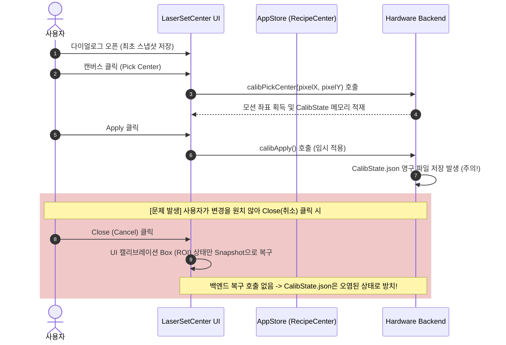

# [보정 왜곡] Laser Set Center 수식 및 제어 흐름 오류 검증/분석 계획서 (V3)

이 문서는 `Laser Set Center` 및 `Camera Center Offset` 다이얼로그에서 보정 데이터를 설정, 적용(Apply), 저장(Save), 취소(Close)하는 전체적인 소프트웨어 제어 흐름 및 기하학적 수식의 잠재적 버그를 검증하고, 이를 해결하기 위한 구체적인 수정 방안을 담은 계획서입니다. 본 문서 하단에 사용자 승인 내용, 변경 히스토리 및 추가 요구사항을 통합하여 함께 관리합니다.

---

## 1. Laser Set Center 설정 및 적용(Apply) 제어 흐름 검증

다이얼로그 내부의 설정/적용 흐름 및 상태 관리 코드를 정밀 검증한 결과, 수학적 계산 버그 외에도 **UI 상태와 하드웨어 백엔드 설정 간의 심각한 상태 미스매치 버그**가 추가로 확인되었습니다.



### 1.1 발견된 3가지 핵심 결함 및 해결 방안

#### ① [FLOW] 다이얼로그 취소(Cancel/Close) 시 백엔드 롤백 누락
* **현상**: 사용자가 픽셀 중심을 클릭하여 보정값을 변경하고 `Apply`를 누른 뒤 `Save`를 누르지 않고 취소(`Close`)하면, 프론트엔드의 UI 뷰포트 상태(`calibrationROI`)만 이전 값으로 복구될 뿐 **백엔드 하드웨어 설정(`CalibState.json`)은 이미 덮어씌워진 상태로 복구되지 않는 현상**이 발생합니다.
* **원인**: `LaserSetCenterDialog.tsx`의 `handleClose` 함수 내에서 백엔드로 이전 스냅샷 상태를 재전송하는 복구 로직이 구현되지 않고 주석 처리되어 있습니다.
* **해결 방안**: 취소 시 최초 로드한 `initialSnapshot`과 현재 변경된 상태를 비교하여 변경 사항이 있다면 `calibPickCenter` -> `calibApply` -> `calibSave` API를 호출하여 하드웨어를 원래의 안전한 상태로 원상 복구시킵니다.

#### ② [STATE] 배율/모드 전환 시 `initialSnapshot` 동기화 해제
* **현상**: 다이얼로그가 열려 있는 상태에서 사용자가 배율(x20 $\leftrightarrow$ x50)이나 모드(Scanner $\leftrightarrow$ Object)를 변경하면 `activeKey`가 변경되지만, 취소 시 복구용 스냅샷(`initialSnapshot`)은 갱신되지 않고 최초 로드된 모드의 값으로 꼬이는 버그가 있습니다.
* **원인**: `refreshState`에서 `initialSnapshot.isLoaded`가 한 번 `true`가 되면 `activeKey`가 바뀌더라도 스냅샷을 덮어쓰지 않는 구조입니다.
* **해결 방안**: `activeKey` 의존성이 바뀔 때마다 스냅샷의 로딩 플래그(`isLoaded`)를 `false`로 클리어하는 `useEffect` 트리거를 주입합니다.

#### ③ [MATH] 기하학적 중심 변환 수식의 오프셋 누락 (LaserSetCenter)
* **현상**: 비전 영상에서 가공 원점을 마우스로 클릭하여 픽셀 중심을 지정할 때, 빨간색 'X' 마커가 마우스 커서 위치에서 어긋나서 렌더링되며 잘못된 보정 픽셀값이 저장됩니다.
* **원인**: `CanvasBackground.tsx`에서 카메라 오버레이 렌더링 시에는 기존 캘리브레이션 오프셋인 `mx, my`가 반영된 좌표에 그려지나, `LaserSetCenterDialog.tsx`에서 클릭 이탈 거리(`relX, relY`)를 역산할 때는 `mx, my`를 차감하지 않고 스테이지 좌표 `pos.X * pxPerMm.x`를 그대로 기준값으로 사용하여 **정확히 `mx` 크기만큼 픽셀 누적 오류**가 누적됩니다.
* **해결 방안**: 클릭 픽셀 역산 시 `recipeCenter`의 현재 오프셋인 `mx, my`를 찾아와서 스테이지 좌표 중심에서 올바르게 차감하도록 수식을 수정합니다.

---

## 2. CameraCenterDialog 설정 및 이동 수식 오류 분석

`CameraCenterDialog.tsx` (카메라 센터 오프셋 설정창)에서 `Set Center` 툴을 사용해 캔버스를 클릭했을 때 장비의 스테이지가 엉뚱한 한계 값 밖으로 튀거나 비정상 이동하는 원인을 확인했습니다.

### 2.1 이중 좌표 합산(Double-Counting) 분석
* **기존 코드**:
  ```typescript
  const offsetX_mm = laserClickPosition.x / pxPerMm.x;
  const newTotalX = stageX + offsetX_mm;
  ```
* **수학적 모순**:
  1. `laserClickPosition.x`는 Fabric.js 캔버스의 디자인 원점(0,0)을 기준점 삼아 픽셀 단위로 측정된 **절대 캔버스 좌표**입니다. 즉, 이를 `pxPerMm`으로 나눈 `offsetX_mm`는 이미 스테이지 기준의 절대 물리 좌표(mm)입니다.
  2. 여기에 현재 장비의 물리적 조그 스테이지 좌표 `stageX`를 더하게 됨으로써, 현재 위치가 **이중으로 합산(Double-counting)**되어 스테이지 타겟이 극단적인 한계치 밖으로 벗어나게 됩니다.
* **해결 방안**:
  카메라 렌더링의 0점 위치 오프셋인 `currentCenter.x` (즉, 기존 캘리브레이션 오프셋인 `mx`)만을 더해 타겟 좌표를 유도해야 합니다.
  ```typescript
  // 올바른 절대좌표 매핑 수식
  const newTotalX = offsetX_mm + currentCenter.x;
  const newTotalY = offsetY_mm + currentCenter.y;
  ```

---

## 3. 세부 소스 코드 수정 제안 (Proposed Changes)

### 3.1 [MODIFY] [LaserSetCenterDialog.tsx](file:///c:/LNG/Source/LW2-3/Portal/src/ui/components/control/LaserSetCenterDialog.tsx)

* **캘리브레이션 오프셋 누락 수식 수정 (라인 193~199 수정)**:
  ```typescript
  // 193행 근처 변경 전
  const pos = useAppStore.getState().positions;
  const pxX = pos.X * pxPerMm.x;
  const pxY = -pos.Y * pxPerMm.y;

  // 변경 후
  const pos = useAppStore.getState().positions;
  const recipeCenter = useAppStore.getState().recipeCenter;
  const currentOffset = recipeCenter[activeKey as 'scanner' | 'object_x20' | 'object_x50'] || { x: 0, y: 0 };
  const mx = currentOffset.x ?? 0;
  const my = currentOffset.y ?? 0;
  const pxX = (pos.X - mx) * pxPerMm.x;
  const pxY = -(pos.Y - my) * pxPerMm.y;
  ```

* **배율 변경 시 스냅샷 리셋 추가 및 닫기 시 백엔드 Revert 롤백 구현 (라인 161~170, 333~355 수정)**:
  ```typescript
  // activeKey 변경 시 스냅샷 상태 초기화 이펙트 추가
  useEffect(() => {
      setInitialSnapshot(prev => ({ ...prev, isLoaded: false }));
      refreshState();
  }, [activeKey, refreshState]);

  // handleClose 기능 구현 전면 개정
  const handleClose = async () => {
      if (initialSnapshot.isLoaded) {
          // UI ROI Box 원 복구
          setCalibrationROI({
              active: initialSnapshot.pixel.x !== W/2 || initialSnapshot.pixel.y !== H/2,
              viewRatio: initialSnapshot.viewRatio,
              center: initialSnapshot.pixel,
              isApplied: true
          });

          // 변경 사항이 있을 경우 백엔드 보정 데이터를 원래 최초 스냅샷 좌표로 복원
          const isChanged = state.pixel.x !== initialSnapshot.pixel.x ||
                            state.pixel.y !== initialSnapshot.pixel.y ||
                            Number(state.viewRatio) !== initialSnapshot.viewRatio;
          if (isChanged) {
              try {
                  await hwFacade.calibPickCenter(activeKey, initialSnapshot.pixel);
                  await hwFacade.calibSetViewRatio(activeKey, initialSnapshot.viewRatio);
                  await hwFacade.calibApply(activeKey);
                  await hwFacade.calibSave();
              } catch (e) {
                  console.error("Failed to revert backend calibration state", e);
              }
          }
      }
      useCanvasStore.getState().setPickedPixel(null);
      setShowLaserSetCenterDialog(false);
  };
  ```

### 3.2 [MODIFY] [CameraCenterDialog.tsx](file:///c:/LNG/Source/LW2-3/Portal/src/ui/components/control/CameraCenterDialog.tsx)

* **좌표 이중 합산 버그 수정 (라인 127~131 수정)**:
  ```typescript
  // 변경 전
  const stageX = positions['X'] ?? 0;
  const stageY = positions['Y'] ?? 0;
  const newTotalX = stageX + offsetX_mm;
  const newTotalY = stageY + offsetY_mm;

  // 변경 후
  const newTotalX = offsetX_mm + currentCenter.x;
  const newTotalY = offsetY_mm + currentCenter.y;
  ```

---

## 4. 검증 및 테스트 시나리오 (Verification Plan)

### 4.1 다이얼로그 조작 및 취소 시 안전성 확인 (Manual)
1. `Laser Set Center` 다이얼로그를 엽니다.
2. 캔버스의 임의 지점을 클릭하여 'Red X' 마커가 지정된 마우스 클릭 자리에 정확히 위치하는지 확인합니다.
3. `Apply`를 눌러 변경 사항을 화면에 임시 적용시킵니다.
4. `Close` 또는 Cancel을 눌러 다이얼로그를 닫습니다.
5. 이후 다시 다이얼로그를 열었을 때, `Captured Position`의 Pixel 값과 Motion 값이 보정 전의 원래 초깃값 상태로 안전하게 복구되어 있는지 확인합니다.

### 4.2 오프셋 이동 검증
1. `Camera Center Offset` 다이얼로그를 열고 `Set Center` 기능을 활성화합니다.
2. 캔버스 화면 상의 임의의 점을 클릭합니다.
3. 스테이지 모션이 비정상 한계 외곽으로 튀지 않고, 캔버스에서 마우스로 클릭하여 지정한 정확한 상대 편차 mm 만큼만 안전하게 미세 이동하여 위치를 보정하는지 육안 및 GUI 좌표로 확인합니다.

---

## 5. 승인 이력 및 요구사항 정리 (Revision & Change History)

이 섹션은 보정 왜곡 개선 진행 과정 중 사용자 승인 내역, 적용된 변경사항, 그리고 추가 요구사항들을 실시간으로 기록하여 관리하는 히스토리 영역입니다.

### 5.1 승인 및 이력 관리

#### [2026-06-12 18:35] Laser Set Center 수식 및 제어 흐름 오류 검증/분석 계획서 (V3) 승인
* **상태**: 승인됨 및 적용 완료
* **주요 수정 내용**:
  1. `LaserSetCenterDialog.tsx`: 클릭된 좌표의 픽셀 역산 식에 기존 오프셋 `(mx, my)` 누락된 것을 반영하여 기하학적 중심 변환 오차 제거.
  2. `LaserSetCenterDialog.tsx`: `activeKey` 변경 시 최초 스냅샷 로드 여부 초기화 적용, 취소(`Close`) 시 변경된 하드웨어 캘리브레이션 상태를 최초 스냅샷 좌표로 백엔드 롤백(`calibPickCenter` -> `calibApply` -> `calibSave`) 구현.
  3. `CameraCenterDialog.tsx`: 캔버스 절대 좌표 환산값에 현재 스테이지 모션 좌표가 이중 합산(Double-counting)되던 버그를 기존 카메라 0점 오프셋 `(mx, my)` 합산 방식으로 개정.

### 5.2 사용자 추가 요구사항 모니터링

1. **문서 관리 규칙**:
   - 보정 왜곡 관련 모든 계획서 및 변경 이력은 별도의 히스토리 파일(`change_history.md`)을 따로 생성하지 않고, 이 통합 계획서 md 파일([calibration_laser_set_center_plan.md](file:///c:/LNG/Source/LW2-3/docs/proc/calibration_laser_set_center_plan.md)) 내부에 통합하여 일원화 관리한다.
2. **최종 종합 정리 기능**:
   - 추후 사용자가 *"지금까지 내용을 정리해줘"* 라고 명시적으로 요구할 경우, [docs/proc/](file:///c:/LNG/Source/LW2-3/docs/proc/) 내에 생성된 개별 md 파일들의 내용을 취합하여 하나의 종합 정리 md 문서로 통합 생성할 것.
