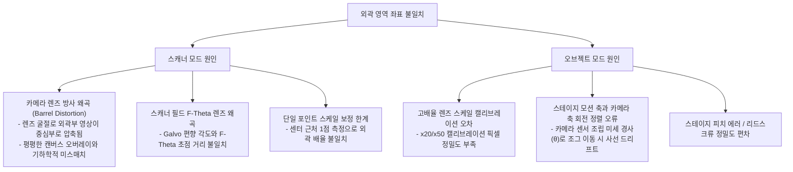

# [보정 왜곡] 카메라 영상 외곽 영역의 가공 및 오버레이 좌표 불일치 개선 계획서

이 문서는 `Laser Set Center` (레이저-카메라 중심 정렬) 완료 후, 화면 중심부에서는 가공선과 오버레이가 일치하지만 외곽으로 갈수록 왜곡(쉬프트)되어 오차가 발생하는 문제에 대한 분석 및 수정 계획서입니다.

---

## 1. 현상 분석 및 근본 원인 (Root Cause Analysis)

첫 번째 첨부 이미지에서 화면 중심부의 사각형/X자 오버레이와 실제 타각된 선은 일치하지만, **좌측 하단 외곽으로 갈수록 캔버스 상의 하늘색 오버레이가 실제 백그라운드 영상(가공선)보다 더 바깥쪽(좌측 하단)으로 쉬프트**되어 나타납니다. 이 현상은 스캐너 모드와 오브젝트 모드 각각 다른 수학적/물리적 요인에 기인합니다.



---

### 1.1 스캐너 모드 (Scanner Mode) 분석

1. **카메라 렌즈 방사 왜곡 (Camera Lens Radial Distortion - Barrel Type)**
   * **원인**: 광각 렌즈(Scanner 렌즈 FOV 커버용)는 굴절률 차이로 인해 **배럴 왜곡(Barrel Distortion)**이 발생합니다.
   * **영향**: 중심부(Optical Axis) 근처는 왜곡이 거의 없으나, 외곽 영역으로 갈수록 카메라 영상 내의 실제 피사체가 중심 방향으로 압축되어 보입니다. 반면, Fabric.js 캔버스 오버레이는 기하학적으로 완벽한 직선(Linear) 평면으로 렌더링되므로 왜곡된 영상 속의 가공선보다 오버레이가 더 바깥쪽에 그려지게 됩니다.
2. **스캐너 보정 파일(Correction File - .ct5) 매칭 편차**
   * **원인**: 스캐너(Galvo)가 빛을 편향시킬 때 왜곡을 보정하기 위해 `D2_969.ct5` 같은 테이블 파일을 RTC 카드가 로드합니다.
   * **영향**: 하드웨어적인 Galvo 조정 값과 Correction File의 스케일 비율(K-factor)에 미세한 편차가 있는 경우, 실제 물리 가공 평면 자체가 외곽부에서 수축/팽창할 수 있습니다.
3. **단일 영역 보정(Single Scale Factor)의 한계**
   * **원인**: 현재 `Calibration Manager`는 단 하나의 직사각형 영역의 가로/세로 픽셀을 측정하여 단일 `Scale X`, `Scale Y` (px/mm) 값을 산출합니다.
   * **영향**: 렌즈의 왜곡률이 위치마다 상이함에도 전 영역에 고정 스케일을 일률 적용하여 외곽 오차가 보상되지 못합니다.

---

### 1.2 오브젝트 모드 (Object Mode) 분석

1. **고배율(x20, x50) 캘리브레이션 픽셀 정밀도 편차**
   * **원인**: 오브젝트 카메라는 시야각(FOV)이 매우 좁아 렌즈 왜곡 자체는 미미합니다. 다만, 배율 캘리브레이션 시 사각형 패턴 마킹의 픽셀 경계선을 수동으로 잡을 때 수 픽셀의 미세 편차가 발생합니다.
   * **영향**: 고배율 렌즈의 스케일 값(`calibrationScales['object_x20']` 등)에 $1\sim2\%$의 편차만 발생해도, 렌더링 크기 수식 $\text{renderW} = \frac{\text{width}}{\text{camScale.x}} \times \text{pxPerMm.x}$에 의해 스테이지 이동 시 배경 영상의 이동 변위와 캔버스의 이동 속도 간 누적 오차(Drift)가 나타납니다.
2. **카메라 축과 스테이지 축의 회전 정렬 오류 (Axis Tilt / Rotation $\theta$)**
   * **원인**: 스테이지 모션 가이드 축(X, Y)과 카메라 내부 센서의 수평/수직 축이 하드웨어 조립 공차로 인해 미세하게 틀어져(예: $0.1^\circ$) 조립됩니다.
   * **영향**: `Laser Set Center`로 정중앙 0점은 맞췄더라도, 외곽(예: $X=10\text{mm}$)으로 갈수록 미세한 사선 방향으로 누적 편차(수직 성분 쉬프트)가 발생하여 어긋나게 보입니다.

---

## 2. 세부 개선 계획서 (Proposed Implementation Plan)

이 문제를 해결하기 위해 **카메라 영상 디스토션 보정 알고리즘(Undistortion Pipeline)**과 **다점(Multi-point) 좌표계 왜곡 보정(Affine Transformation)**을 도입합니다.

```
[카메라 영상 획득 (HikRobot SDK)] 
       ↓
[OpenCV Undistortion 적용 (Camera Matrix K & Distortion D)] ← 렌즈 고유 왜곡 계수 적용
       ↓
[왜곡이 제거된 실시간 MJPEG 프레임 생성]
       ↓
[프론트엔드 UI 렌더링 및 Affine Matrix 기반 2D 사영] ← 회전/전단 왜곡 Compensation
```

---

### 2.1 [BACKEND] OpenCV 기반 실시간 카메라 Undistort 적용
* **수정 파일**: [HikDriver.cpp](file:///c:/LNG/Source/LW2-3/VisionModule/VisionModule/Device/Hikrobot/Wrapper/HikCamWrapper.cpp) 및 [VisionModuleImpl.cpp](file:///c:/LNG/Source/LW2-3/VisionModule/VisionModule/Core/VisionModuleImpl.cpp)
* **내용**:
  - 카메라 렌즈의 고유 특성 파일(`Config/LensDistortion.json`)을 로드하여 카메라 매트릭스($K$)와 왜곡 계수($D = [k_1, k_2, p_1, p_2]$)를 관리합니다.
  - 프레임을 Grab할 때 OpenCV의 `cv::initUndistortRectifyMap`과 `cv::remap`을 사용하여 영상을 실시간으로 평평하게 보정한 후 프론트엔드로 송출합니다.
  - 디버그 및 튜닝 속도 향상을 위해 캘리브레이션용 계수($k_1$)를 라이브 브라우저 UI에서 미세 조정하여 배럴 왜곡을 수동으로 상쇄할 수 있는 API를 노출합니다.

---

### 2.2 [FRONTEND] 다점(Grid/Corner) 보정 캘리브레이션 인터페이스 추가
* **수정 파일**: [CalibrationDialog.tsx](file:///c:/LNG/Source/LW2-3/Portal/src/ui/components/control/CalibrationDialog.tsx), [useCalibrationStore.ts](file:///c:/LNG/Source/LW2-3/Portal/src/ui/pages/Calibration/useCalibrationStore.ts)
* **내용**:
  - 기존 1개 사각형 중심 측정 외에, 외곽 영역 4점(Corners) 혹은 9점(Grid)을 타각하여 측정하는 **Grid Calibration** 모드를 추가합니다.
  - 측정된 좌표 쌍을 기반으로 투영 변환(Perspective/Affine Transformation Matrix)을 계산하여 좌표 일치도를 극대화합니다.
  - **오브젝트 모드(Object Mode)**의 경우, 카메라 회전 각도($\theta$)를 포함한 $3\times3$ 아핀 행렬을 적용하여 스테이지 이동 시의 회전 어긋남을 동시 보상합니다.

```typescript
// Proposed Affine Transformation logic for coordinate compensation
export interface AffineMatrix {
    a: number; b: number; c: number; // x' = a*x + b*y + c
    d: number; e: number; f: number; // y' = d*x + e*y + f
}
```

---

### 2.3 [FRONTEND] 속성창 및 가공 경로 생성 수식 보정 연동
* **수정 파일**: [ScannerGenerator.ts](file:///c:/LNG/Source/LW2-3/Portal/src/services/ScannerGenerator.ts), [CanvasBackground.tsx](file:///c:/LNG/Source/LW2-3/Portal/src/ui/pages/Recipe/Canvas/CanvasBackground.tsx)
* **내용**:
  - 스캐너 및 오브젝트 캘리브레이션 데이터를 단순 배율(`Scale X/Y`)에서 `Calibration Matrix` 구조로 확장 적용합니다.
  - `ScannerGenerator.ts`에서 G-Code 및 갈보 명령어 생성 시, 캘리브레이션 결과로 저장된 보정 행렬(또는 디스토션 보상 수식)을 반영하여 타각 명령 좌표를 최종 생성합니다.

---

## 3. 검증 계획 (Verification Plan)

### 3.1 수동/라이브 가시성 검증
1. **중심 및 4모서리 패턴 마킹**:
   - 가공 보드 판에 중심(0,0)과 네 모서리(예: X -10, Y -10 ~ X 10, Y 10 범위)에 격자점 또는 십자선 마킹을 타각합니다.
2. **오버레이 중첩 확인**:
   - 카메라 뷰어에 마킹된 영상 위로, 설계 소프트웨어(Fabric Canvas) 상에 동일한 크기로 생성한 십자/격자선 그리드를 중첩시킵니다.
   - 중심부뿐만 아니라 모서리 영역에서도 엇갈림 편차가 **0.05mm 이하(픽셀 단위 2~3px 이내)**로 축소되었는지 검증합니다.

### 3.2 오브젝트 모드 이동 검증
1. **조그 사선 이동 정밀도**:
   - 스테이지를 사선 방향(JOG X+ Y+)으로 10mm 이동하면서, 타각한 가공점이 카메라 중심선을 벗어나 다른 사선 방향으로 흐르는지(축 정렬 회전 오류 여부) 카메라 뷰를 관찰합니다.
   - 보정 후 축 경사각 보상이 정상 작동하여 가공점이 정렬선 상을 정확히 추적하는지 체크합니다.
