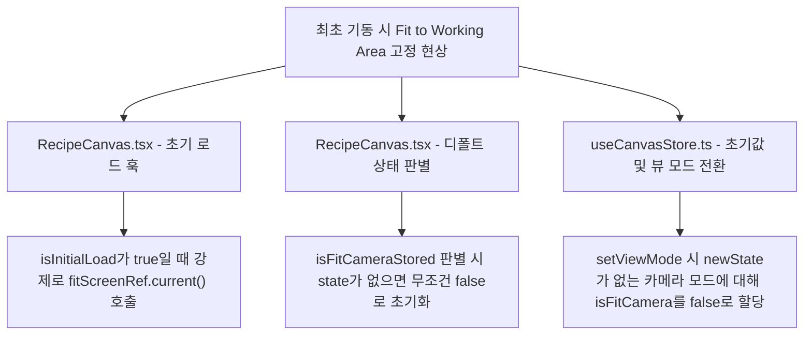

# [뷰포트] 최초 기동 시 디폴트 뷰포트 핏 (Fit to Camera FOV) 개선 계획서

이 문서는 프로그램 시작 시 디폴트 뷰포트 화면을 기존의 'Fit to Working Area' (작업 영역 맞춤)에서 'Fit to Camera FOV' (카메라 시야 영역 맞춤)로 변경하기 위한 원인 분석 및 수정 계획서입니다.

---

## 1. 현상 분석 및 근본 원인 (Root Cause Analysis)

프로그램이 최초 기동되거나 캔버스 상태(Zoom, Pan)가 유효하지 않은 경우, 화면 뷰포트가 항상 `Fit to Working Area` (배율 약 0.42% ~ 0.93% 수준)로 기본 렌더링되고 있습니다. 이는 다음 3가지 코드 레벨의 원인에 기인합니다.



### 1.1 `RecipeCanvas.tsx` 초기 렌더링 및 뷰 복원 로직의 분기 한계
* **원인**: `RecipeCanvas.tsx` 내의 `useEffect` 뷰 복원 훅은 `isInitialLoad === true` 인 시점(최초 실행 시)에 저장된 뷰포트 상태와 관계없이 항상 `fitScreenRef.current()` (Fit to Working Area)를 호출하도록 강제되어 있습니다.
* **이유**: `isInitialLoad`를 통해 최초 기동 시에는 핏을 맞추도록 기획되었으나, 그 핏 방식이 `Fit to Working Area`로 고정되어 있었기 때문입니다.

### 1.2 카메라 핏 복원 기본값(Default fallback)의 편향
* **원인**: 저장된 `viewStates`가 없거나 해당 모드에 저장된 설정이 존재하지 않을 때, `isFitCameraStored` 변수를 `false`로 할당합니다.
  ```typescript
  const isFitCameraStored = state ? (state.isFitCamera !== undefined ? state.isFitCamera : false) : false;
  ```
* **이유**: `state.isFitCamera`가 명시되지 않은 상태에서는 디폴트로 Working Area 맞춤이 적용되어, 최초 모드 진입 시 카메라 맞춤이 아닌 전체 스테이지 맞춤으로 쏠리게 됩니다.

### 1.3 `useCanvasStore.ts` 내의 뷰 모드 전환 시 초기값 설정
* **원인**: `setViewMode` 함수가 호출되어 새로운 뷰 모드로 전환될 때, 새로운 모드에 저장된 뷰포트 상태가 없는 경우 `isFitCamera` 필드를 다음과 같이 계산합니다:
  ```typescript
  isFitCamera: newMode === 'object' ? true : (newState.isFitCamera !== undefined ? newState.isFitCamera : false)
  ```
* **이유**: `newMode === 'scanner'` 일 때 저장된 상태가 없으면 무조건 `false` (Fit to Working Area)로 지정되고 있어, `scanner` 모드로 전환될 때 기본 동작이 Working Area 핏으로 동작하게 됩니다.

---

## 2. 세부 개선 계획서 (Proposed Implementation Plan)

이 문제를 해결하기 위해, 최초 실행(`isInitialLoad`) 또는 저장된 상태가 없는 뷰포트 로딩 시 카메라 관련 모드(`scanner`, `object`)에 대해서는 `Fit to Camera FOV`를 디폴트로 적용하도록 로직을 수정합니다.

### 2.1 [FRONTEND] `RecipeCanvas.tsx` 초기 핏 분기 및 디폴트 값 개선
* **대상 파일**: [RecipeCanvas.tsx](file:///c:/LNG/Source/LW2-3/Portal/src/ui/pages/Recipe/Canvas/RecipeCanvas.tsx)
* **내용**:
  - `isFitCameraStored` 판별 시, 저장된 상태가 없을 때 `isCameraMode` (즉 `viewMode === 'scanner' || viewMode === 'object'`) 값을 기본값으로 반환하도록 수정합니다.
  - `isInitialLoad === true` 이거나 저장된 줌 값이 없을 때, `isCameraMode`에 따라 `fitCameraAreaRef.current()` 또는 `fitScreenRef.current()`로 나누어 호출하도록 분기합니다.

```typescript
// Proposed modification in RecipeCanvas.tsx (Restoration Effect)
const isCameraMode = viewMode === 'scanner' || viewMode === 'object';
// [FIX] Default to isCameraMode (true for camera-relative views) instead of false
const isFitCameraStored = state ? (state.isFitCamera !== undefined ? state.isFitCamera : isCameraMode) : isCameraMode;
```

```typescript
// Proposed logic for Initial load or Zoom=0 section in RecipeCanvas.tsx
console.log('[RecipeCanvas] Initializing View. Mode:', viewMode, 'isInitialLoad:', isInitialLoad);
if (isInitialLoad) setIsInitialLoad(false); // Consume the initial load flag

if (isCameraMode) {
    useCanvasStore.getState().setIsFitCamera(true);
    fitCameraAreaRef.current();
} else {
    useCanvasStore.getState().setIsFitCamera(false);
    fitScreenRef.current();
}
```

### 2.2 [FRONTEND] `useCanvasStore.ts` 뷰 모드 전환 및 초기 스토어 상태 교정
* **대상 파일**: [useCanvasStore.ts](file:///c:/LNG/Source/LW2-3/Portal/src/ui/pages/Recipe/Canvas/useCanvasStore.ts)
* **내용**:
  - `setViewMode` 에서 `isFitCamera`를 업데이트할 때, 신규 모드가 카메라 모드(`isCam`)인 경우 저장된 값이 없을 때 기본값으로 `true`를 부여하도록 식을 변경합니다.
  - 스토어 최초 인스턴스화 시 `isFitCamera` 의 기본값을 `true` 로 변경하여, 최초 기동 시 선택되어 있는 `scanner` 모드의 기본 상태와 동기화시킵니다.

```typescript
// Proposed modification in useCanvasStore.ts (setViewMode Action)
const isCam = newMode === 'scanner' || newMode === 'object';
// ...
return {
    // ...
    isFitCamera: isCam ? (newState.isFitCamera !== undefined ? newState.isFitCamera : true) : false
};
```

---

## 3. 검증 계획 (Verification Plan)

### 3.1 최초 프로그램 기동 테스트 (디폴트 뷰 검증)
1. 브라우저 로컬 스토리지(`recipe_canvas_view_states`)를 삭제하거나 강제 초기화하여 저장된 뷰포트 상태를 제거합니다.
2. 프로그램을 새로고침/재기동합니다.
3. 최초 화면이 로딩되었을 때 하단의 줌 배율이 **약 42.8%** 근처로 나타나며, 화면의 격자 및 카메라 영상이 `Fit to Camera FOV` 상태(Camera Area가 화면에 꽉 참)로 렌더링되는지 확인합니다.

### 3.2 뷰 모드 전환 시 기본 상태 검증
1. 로컬 스토리지가 비워진 상태에서, 상단 탭을 `Scanner`에서 `Canvas`로 전환했다가 다시 `Scanner`로 전환합니다.
2. `Canvas` 모드에서는 `Fit to Working Area` (0.93% 등)로 렌더링되며, `Scanner` 모드로 돌아왔을 때 다시 `Fit to Camera FOV`로 알맞게 유지/복원되는지 확인합니다.

---

## 4. 코드 수정 작업 내역 (Implementation Summary)

* (수정 완료 후 작성 예정)
